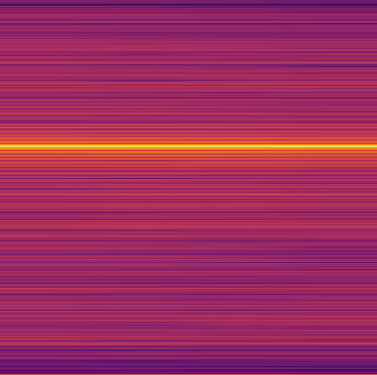
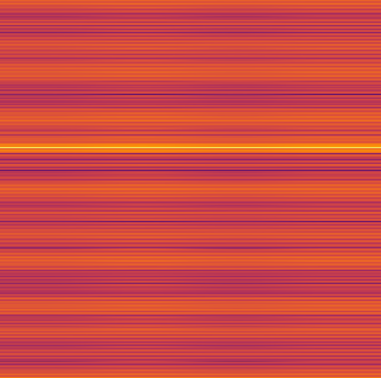
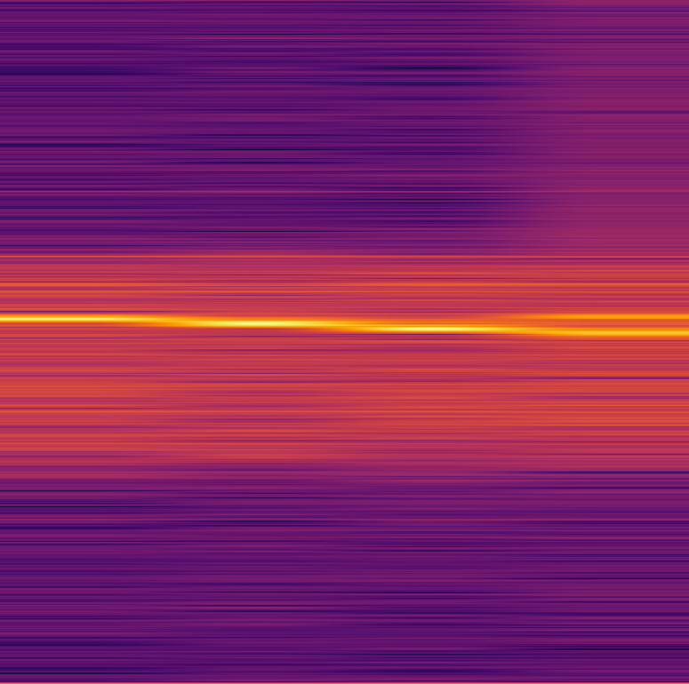

# 分类问题通用架构
😋😝🥸🫠😯

#### 数据预处理
将原始波形数据转化为语谱图（[process_code](src/dataloader/preprocess.py)）
<figure class="third">
    
    
    
</figure>
<figure class="third">
    
    
    
</figure>
<figure class="third">
    
    
    
</figure>
<figure class="third">
    
    
    
</figure>
<figure>
    
</figure> 

#### 训练
```bash
nohup python src/run/run.py > nohups/training.log 2>&1 &
```
参数说明: [args_log](configs/get_args.py)

#### 验证集结果
| id           | loss        | _accuracy   | precision_weighted | precision_macro | precision_micro | recall_weighted | recall_macro | recall_micro | f1_weighted | f1_macro    | f1_micro    | _seed | criterion_name                | classifier_params_input_dim | classifier_params_dropout_rate | learning_rate_visual | learning_rate_other | weight_decay_visual | weight_decay_other | _batch_size |
|--------------|-------------|-------------|--------------------|-----------------|-----------------|-----------------|--------------|--------------|-------------|-------------|-------------|-------|-------------------------------|-----------------------------|--------------------------------|----------------------|---------------------|---------------------|--------------------|-------------|
| vgg19        | 0.066413604 | 0.972678399 | 0.971404303        | 0.958877132     | 0.970452447     | 0.970452447     | 0.954976741  | 0.970452447  | 0.970439361 | 0.956126703 | 0.970452447 | 1     | ASLSingleLabel | 25088                       | 0.1                            | 0.0001               | 0.007               | 0.004               | 0.002              | 256         |
| shufflenetv2 | 0.095507267 | 0.967274396 | 0.968572354        | 0.953265232     | 0.966874513     | 0.966874513     | 0.94848694   | 0.966874513  | 0.967098648 | 0.949349401 | 0.966874513 | 1     | ASLSingleLabel | 50176                       | 0.1                            | 0.0003               | 0.004               | 0.001               | 0.004              | 32          |
| resnet50     | 0.098049748 | 0.966242757 | 0.969544823        | 0.955430396     | 0.968546638     | 0.968546638     | 0.961476312  | 0.968546638  | 0.96858964  | 0.957352674 | 0.968546638 | 1     | ASLSingleLabel | 2048                        | 0.1                            | 0.0001               | 0.001               | 0.01                | 0.005              | 256         |
| resnet18     | 0.114296517 | 0.966531853 | 0.968925758        | 0.959056621     | 0.968185105     | 0.968185105     | 0.948541479  | 0.968185105  | 0.968102855 | 0.951582671 | 0.968185105 | 1     | ASLSingleLabel | 512                         | 0.1                            | 0.0001               | 0.003               | 0.004               | 0.003              | 256         |

#### 预测结果
1. 按照格式要求进行预测: [prediction_submit](src/run/test_submit.py)
    ```bash
    nohup python src/run/test_submit.py > nohups/predictions.log 2>&1 &
    ```
2. 训练集 + 验证集: [train_predictions](results/JHT/JHTModel/shufflenetv2_predictions_for_train_data.log)
3. 测试集: [test_predictions](results/JHT/JHTModel/shufflenetv2_predictions_for_test_data.log)